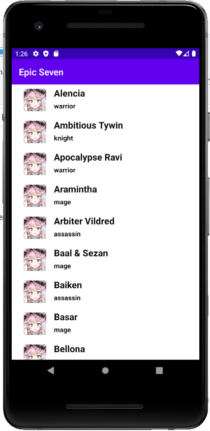

# Android Project - Epic Seven (Java)

## Author
Yi-Hsuan Lee

## Introduction

Android Project - Epic Seven is a mobile application based on the mobile game Epic Seven.
The purpose of this mobile application is to display a list of heroes and their characteristics such as their name, id, role, etc.
This application can be used as a database where the most curious players can discover the history of their favorite characters.

Designed using the Rest API EpicSevenDB.
- [GitHub](https://github.com/EpicSevenDB/api)
- [Swagger](https://api.epicsevendb.com/)

---

## Features

The project includes the use of several technical features and methods. So here is a list of what was used while coding the application.
- [RecyclerView](https://developer.android.com/guide/topics/ui/layout/recyclerview)
- [Gitflow](https://www.atlassian.com/fr/git/tutorials/comparing-workflows/gitflow-workflow)
- [Retrofit](https://square.github.io/retrofit/)
- [Rest API](https://www.astera.com/fr/type/blog/rest-api-definition/)
- [SharedPreferences](https://developer.android.com/reference/android/content/SharedPreferences?hl=en)
- [Picasso](https://github.com/square/picasso)
- [Search Interface](https://developer.android.com/training/search/setup)
- [App Icon](https://developer.android.com/studio/write/image-asset-studio)
- [MVC Architecture](https://medium.com/upday-devs/android-architecture-patterns-part-1-model-view-controller-3baecef5f2b6)
- [SOLID Principles](https://www.baeldung.com/solid-principles)
- [ReadMe](https://github.com/Simplonline-foad/utiliser-markdown/blob/master/README.md)

---

## Implementations

several features have been implemented within this application.
- Screen with a list of items
- Screen with the detail of an element
- WebService call to a Rest API
- Cached data storage
- Application Icon
- MVC Architecture
- Singleton
- Gitflow (permanent: master/develop) (temporary: features/releases)
- Design
- SOLID Principles
- ReadMe

---

## How the mobile app works ?

### First Activity: List of heroes

> When launching the application, the list of heroes is displayed.
> You can then slide down to discover the different heroes and their roles.

### Second Activity: Hero Information

> The Hero Information activity gathers information concerning the hero chosen previously in the List of Heroes activity.

---

### Improvements

In order to improve the mobile application we can integrate:
 - Main menu before displaying the list of Heroes
 - More details displayed in the second activity
 - Artifacts and equipment for heroes
 - Notification push in order to alert something new

---

## Changelog
> ### v0.0.2 (02/05/2020)
>
> - Added ReadMe
>
> ----------
>
> ### v0.0.1 (16/06/2020)
>
> - Added Displaying a hero list
> - Added Displaying hero details
> - Added MVC Architecture
> - Added Singleton
> - Added SOLID Principles
> - Added Application Icon